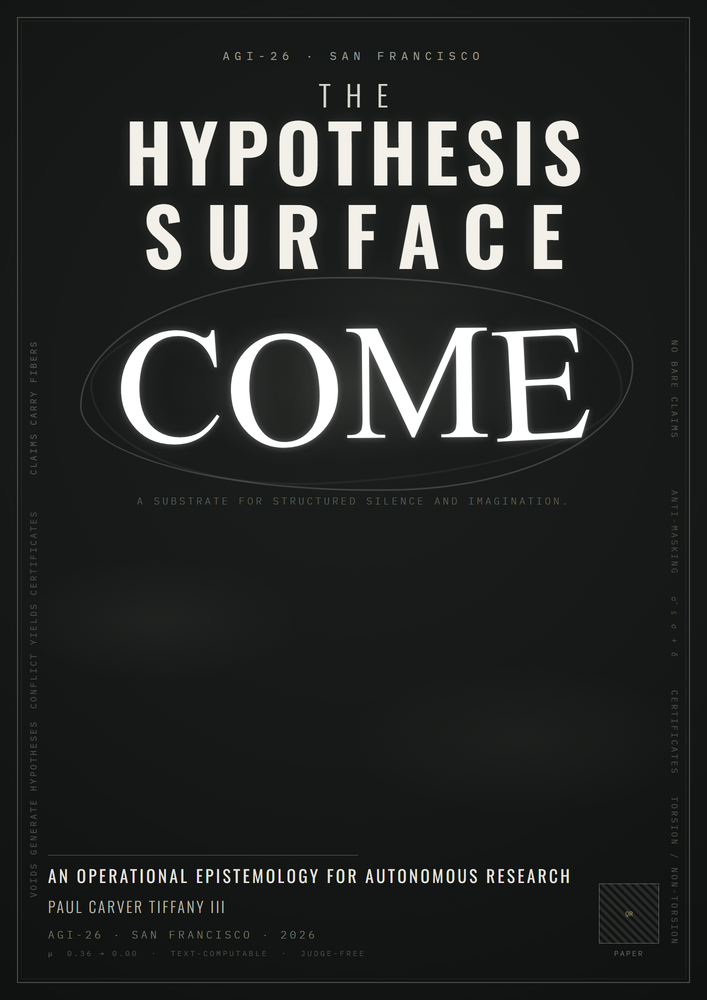

  

  <a href="poster/"><strong>Poster</strong></a>
  &nbsp;|&nbsp;
  <a href="https://paultiffany.github.io/hypothesis-surface-agi26/"><strong>Paper materials</strong></a>
  &nbsp;|&nbsp;
  <a href="https://github.com/PaulTiffany/Come"><strong>Companion pipeline</strong></a>
  &nbsp;|&nbsp;
  <a href="https://github.com/PaulTiffany/sketched"><strong>Hackathon app</strong></a>
  &nbsp;|&nbsp;
  <a href="tour/"><strong>Tour</strong></a>

Paper (AGI-26, Springer LNAI) and rebuttal materials — links added once public.

